<div align="center">

<!-- Adaptive Hero: Automatically matches GitHub Dark & Light themes with real-time telemetry -->
<picture>
  <source media="(prefers-color-scheme: light)" srcset="assets/profile/hero-light.svg">
  
</picture>

<br>

**[▸ ENTER INTERACTIVE PROFILE](https://jacek4yang.github.io)** &nbsp;·&nbsp;
**[SYSTEM TOPOLOGY](https://jacek4yang.github.io)** &nbsp;·&nbsp;
**[REPOSITORIES (31)](https://github.com/jacek4yang?tab=repositories)**

<br>

</div>

## Selected Work

### ⚡ Wire Protocols & Network Engines

- **[rust-reality](https://github.com/jacek4yang/rust-reality)** `Rust` `VLESS` `REALITY` `Zero-Copy`  
  From-scratch VLESS + REALITY + XTLS Vision proxy server with Xray-compatible data paths. Features kernel `splice` relays, zero-copy record batching, and hand-written assembly session crypto. Tuned for 1-vCPU hosts; handoff topology sheds ~82% line-download CPU/GiB.

- **[egressdns](https://github.com/jacek4yang/egressdns)** `Rust` `DNS` `DoH3/DoQ` `DNSSEC`  
  Egress-aware adaptive DNS caching forwarder for enterprise LANs. Supports DoT, DoH2, DoH3, and DoQ upstreams with full DNSSEC validation. Dynamically selects optimal transports based on live network latency and hedging metrics.

- **[veilweave](https://github.com/jacek4yang/veilweave)** `Rust` `Post-Quantum` `WebSocket` `Cloudflare Workers`  
  Post-quantum, forward-secret VLESS over WebSocket, running end-to-end through Cloudflare Workers.

- **[rust-xhttp](https://github.com/jacek4yang/rust-xhttp)** `Rust` `XHTTP` `VLESS`  
  Pure-Rust XHTTP/VLESS server fully compatible with official Xray-core clients.

---

### 🤖 Autonomous AI & Reverse Engineering

- **[reverse-mcp](https://github.com/jacek4yang/reverse-mcp)** `Rust` `MCP` `IDA Pro` `idalib` `Reverse-Eng`  
  Headless IDA Pro 9.2 agent server exposing 17 MCP tools over stdio and HTTP for autonomous AI binary analysis. Built directly on native `idalib` without Python bridges, featuring strict `expected_revision` mutation guards.

- **[cline-proxy](https://github.com/jacek4yang/cline-proxy)** `Rust` `API Gateway` `SSE` `Claude Code`  
  High-fidelity Rust gateway aggregating multi-key Cline pools for Claude Code and OpenAI tooling. Implements a strict `Healthy → Cooling → HalfOpen` state machine with stateful bidirectional SSE dialect translation.

- **[codebuddy-proxy](https://github.com/jacek4yang/codebuddy-proxy)** & **[lobsterai-proxy](https://github.com/jacek4yang/lobsterai-proxy)** `Rust` `Agent Infra` `Proxy`  
  Specialized Anthropic Messages API proxies optimized for terminal coding agents and multi-account load distribution.

- **[agent-pulse](https://github.com/jacek4yang/agent-pulse)** `Rust` `Windows` `Automation`  
  Lightweight Windows automation scheduler for reliably resuming terminal coding agents across quota cooldowns and context windows.

---

### 🦀 Systems, Cryptography & Tooling

- **[fastcrypto-rs](https://github.com/jacek4yang/fastcrypto-rs)** `Rust` `Cryptography` `Benchmarks`  
  Cryptographic R&D testbed benchmarking X25519, AES-GCM, SHA-2, and post-quantum ML-KEM-768 against production incumbents. Only primitives yielding real workload throughput improvements are promoted into upstream servers.

- **[rnc](https://github.com/jacek4yang/rnc)** `Rust` `Windows` `Networking` `Unicode`  
  Binary-safe Rust netcat with native Windows Unicode, UTF-8, GBK, and GB18030 console support, preventing byte stream corruption in CTF and pipeline workflows.

- **[rime-xhup-flow](https://github.com/jacek4yang/rime-xhup-flow)** `Rime` `Input Method` `Trainer`  
  High-efficiency 小鹤音形 (XHUP Flow) Rime input scheme with tiered multi-level code training, low-latency fixed encoding, and graphical trainer.

<br>

## Technical Focus

```text
WIRE-LEVEL    Kernel splice · zero-copy ring buffers · assembly hot paths · custom TLS handshakes
AGENTS        Native idalib bindings · MCP protocol servers · streaming SSE dialect translation
EVIDENCE      Zero guessing · benchmarked on real payload distributions · strict fail-closed invariants
SYSTEMS       Rust async · native Windows Unicode (GB18030) · post-quantum primitives (ML-KEM-768)
```

The full interactive map — every project as a node in one live topology graph — lives at **[jacek4yang.github.io](https://jacek4yang.github.io)**.

<div align="center">
<br>

[](https://jacek4yang.github.io)

<br>
<sub>Profile assets automatically regenerated from live GitHub telemetry · No external metrics tracking</sub>
</div>
